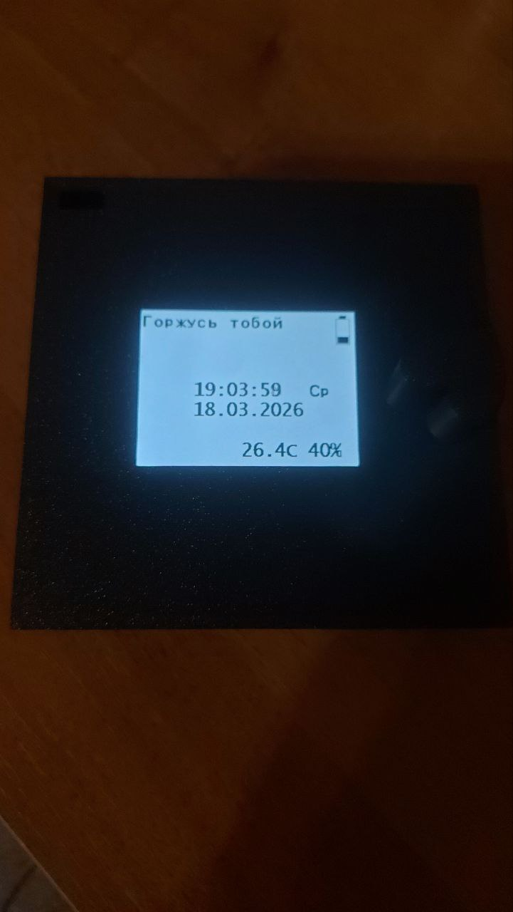
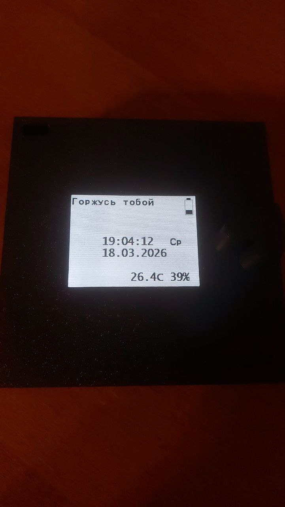
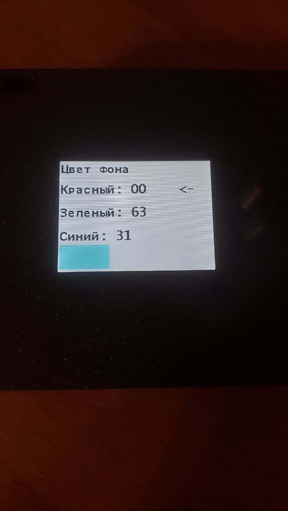
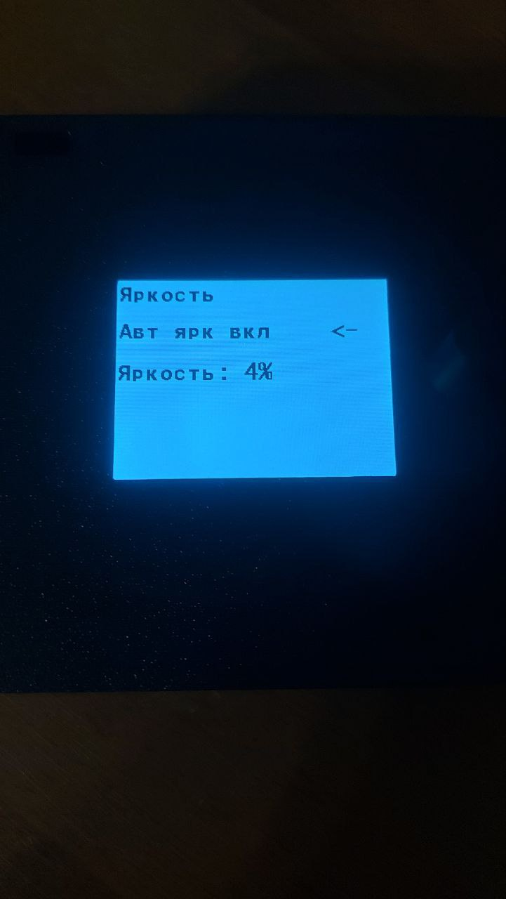
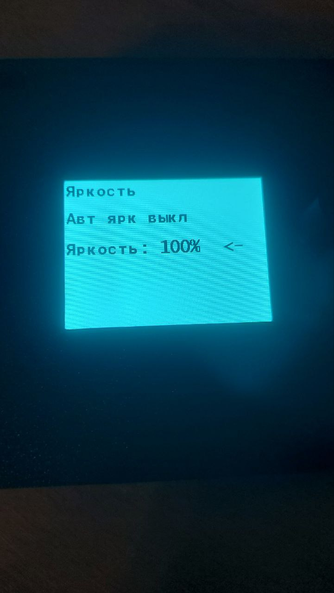
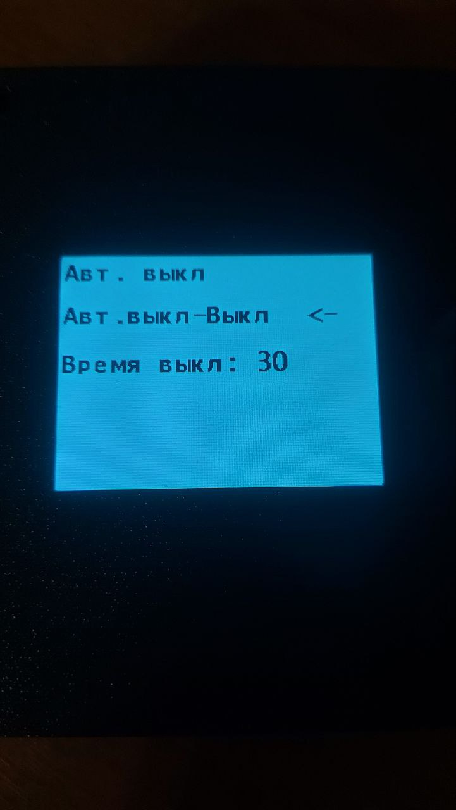
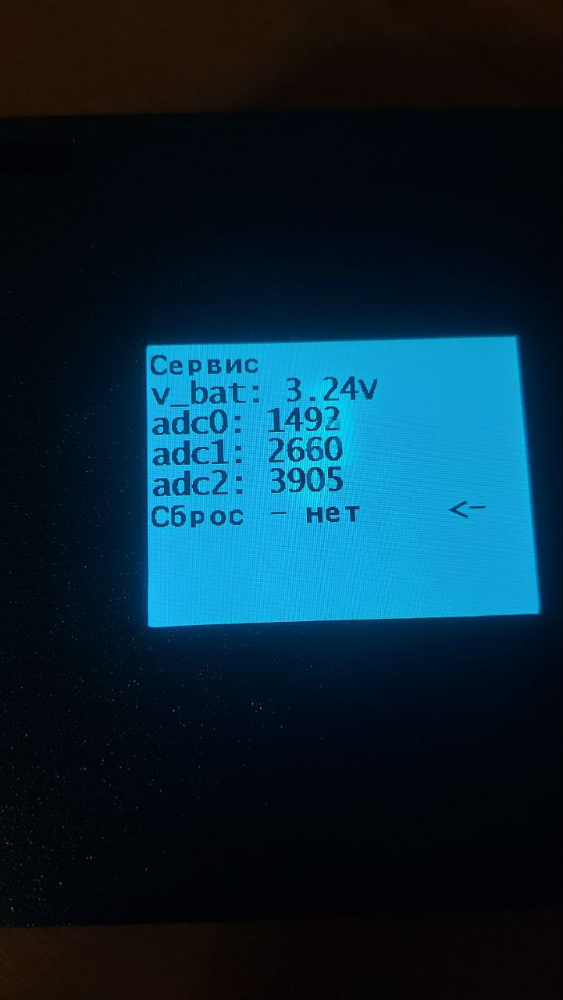

# Персональные часы на STM32 + ST7789

Электронные часы с цветным дисплеем ST7789, датчиком температуры/влажности HDC2080 и очень тёплым, личным характером.

Создано с любовью для особенного человека 💕

## ✨ Основные возможности

- Красивый цветной интерфейс 320×240 px (ST7789)
- Романтические фразы на главном экране (автосмена каждый час)
- Специальные поздравления на Новый год, День рождения и годовщину
- Будильник с плавной мелодией
- Автоматическая и ручная регулировка яркости
- Автоматическое выключение экрана для экономии батареи
- Отображение температуры и влажности (HDC2080)
- Контроль уровня заряда аккумулятора
- Полностью управляется поворотным энкодером

## 📸 Фото устройства

Вот так выглядят работающие часы:

## 🛠 Технические характеристики

- **Микроконтроллер**: STM32F103 (Blue Pill / Black Pill / кастомная плата)
- **Дисплей**: ST7789 1.54" или 2.0" (SPI + DMA)
- **Датчик климата**: HDC2080 (I²C)
- **Управление**: Поворотный энкодер с кнопкой
- **Питание**: Li-Ion аккумулятор + зарядка
- **Яркость**: PWM + фоторезистор (авторежим)

## 🚀 Как собрать и прошить

### Требования

- **STM32CubeIDE** (рекомендуется)
- ST-Link / J-Link
- STM32CubeMX (при необходимости регенерации)

### Инструкция по сборке

1. Откройте проект в **STM32CubeIDE**
2. Убедитесь, что файлы `st7789.c` и `fonts.c` добавлены в проект
3. Соберите проект (**Project → Build Project** или `Ctrl+B`)
4. Подключите отладчик ST-Link
5. Загрузите прошивку (**Run → Run** или `Ctrl+F11`)

## 🎮 Управление

- **Короткое нажатие** энкодера — вход в меню / переключение параметров
- **Длинное нажатие** (>800 мс) — выход из меню с сохранением настроек
- **Поворот** — изменение значений и навигация по меню

## Лицензия

Проект распространяется под лицензией **GPL-3.0**.
